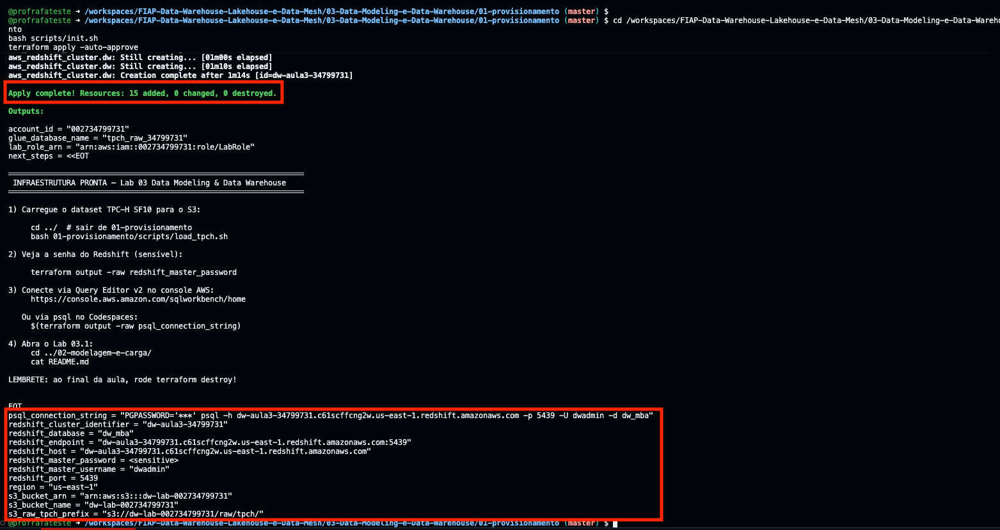
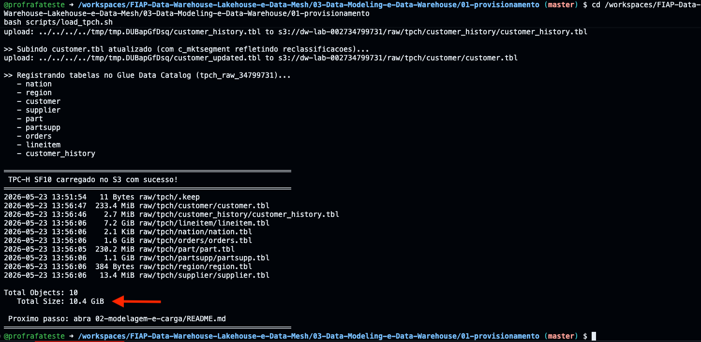
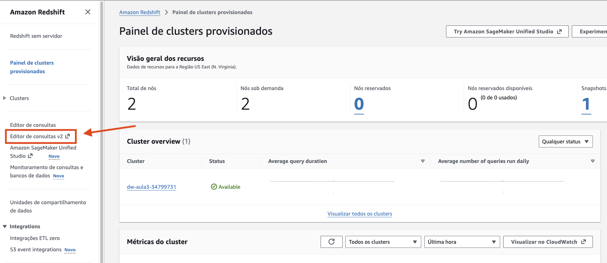
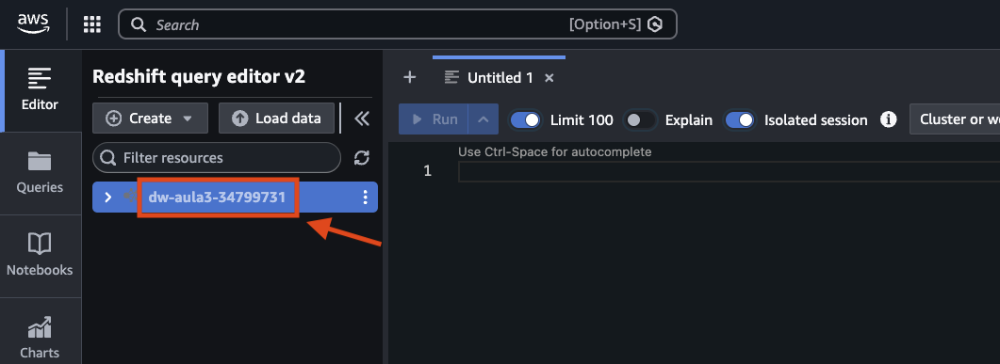
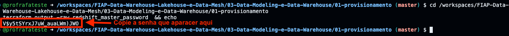
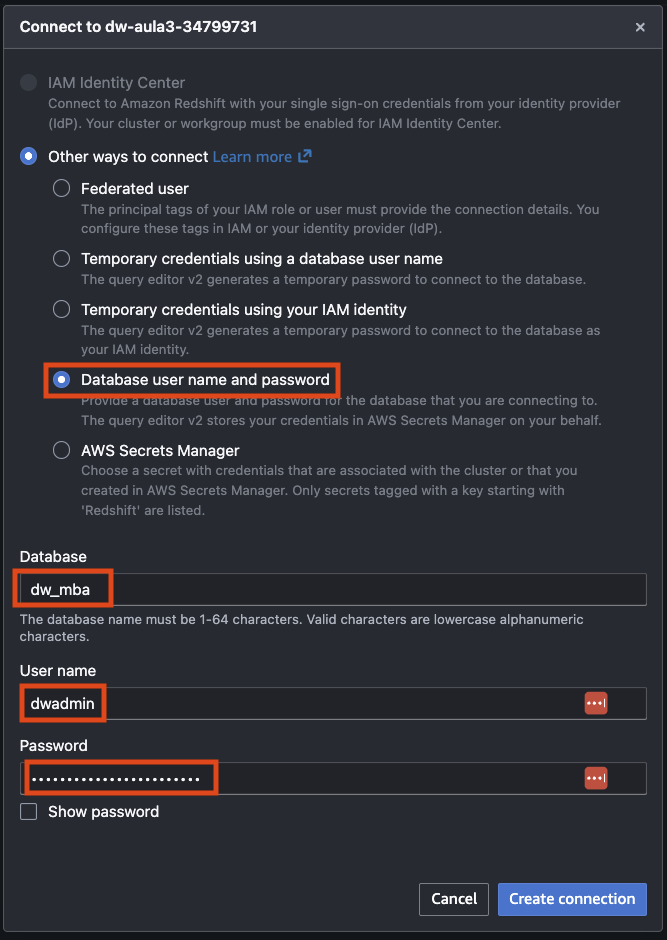
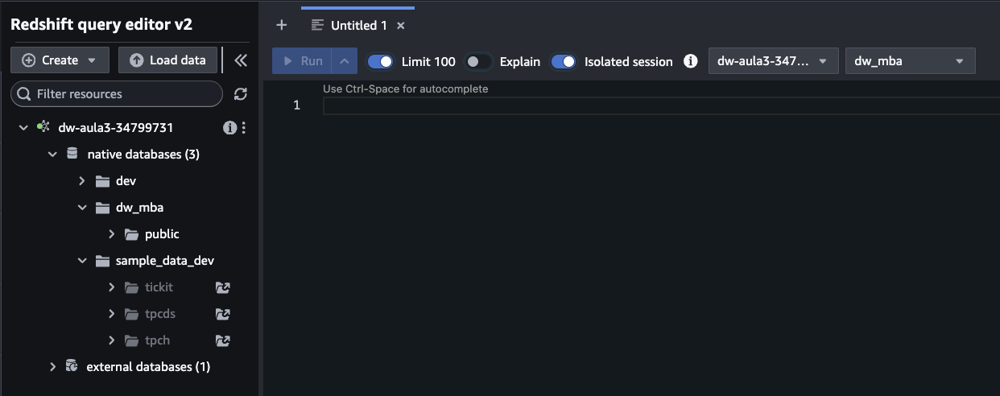
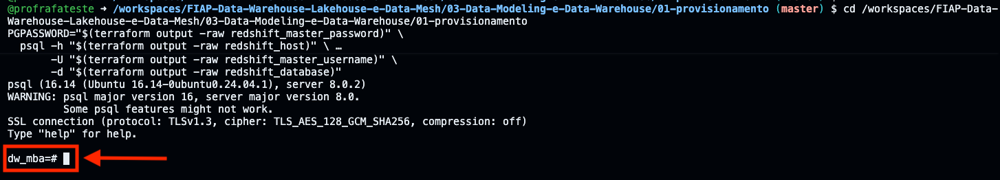
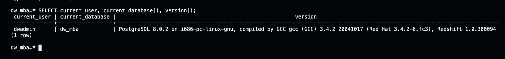

# 03.1 - Provisionamento da infraestrutura

Este é o primeiro passo do Lab 03. Aqui o aluno sobe — via **Terraform** — toda a infraestrutura necessária para os exercícios de modelagem dimensional e Redshift. Nenhum clique em console além de copiar credenciais do AWS Academy.

> [!TIP]
> Leia primeiro a [proposta geral do Lab 03](../README.md) antes de executar este passo. Aqui o foco é **operacional**: subir, usar, destruir.

## Arquitetura


O diagrama acima resume o fluxo: (1) aluno roda `terraform apply` no Codespaces, (2) Terraform assume a `LabRole` pré-existente, (3) três recursos são criados na conta AWS (S3, Glue Catalog, Redshift), (4) aluno conecta via Query Editor v2 e (5) roda uma única vez o `load_tpch.sh` para carregar o dataset.

Fonte editável: [`img/arquitetura-provisionamento.drawio`](img/arquitetura-provisionamento.drawio) (abrir em [app.diagrams.net](https://app.diagrams.net/) ou draw.io Desktop).

---

## O que este provisionamento cria

| Recurso | Configuração | Por quê |
|---------|--------------|---------|
| **S3 Bucket** `dw-lab-<ACCOUNT_ID>` | SSE-S3, versionamento off, `force_destroy=true` | Armazena TPC-H em Parquet + resultados de `UNLOAD` |
| **Glue Catalog Database** `tpch_raw_<short_id>` | Catálogo do TPC-H para referência visual | O Learner Lab permite Glue Catalog. Spectrum **não** é usado |
| **Redshift Subnet Group** | Todas as subnets da VPC default | Learner Lab não permite criar VPC nova |
| **Security Group Redshift** | Ingress TCP 5439 do CIDR configurável (default `0.0.0.0/0`), egress liberado | Permite Codespaces e Query Editor v2 chegarem no cluster |
| **Redshift Cluster** `dw-aula3-<short_id>` | `ra3.large` × 1 nó, `publicly_accessible=true`, `encrypted=true`, `iam_roles=[LabRole]` | Único tipo de nó permitido pelo Learner Lab; 1 nó economiza budget |

> [!IMPORTANT]
> **Nenhuma IAM role é criada**. O cluster recebe a `LabRole` pré-existente do Learner Lab via `iam_roles = [data.aws_iam_role.lab_role.arn]`. Essa role tem permissão para ler o S3 do próprio bucket criado aqui, graças às policies default do Learner Lab.

---

## Pré-requisitos

- Laboratório [00 — setup](../../00-create-codespaces/README.md) concluído
- Credenciais AWS atualizadas em `~/.aws/credentials` (sessão ativa no AWS Academy)
- Codespaces rodando com o devcontainer da disciplina (já traz Terraform e AWS CLI)

Validação rápida dentro do Codespaces:

```bash
aws sts get-caller-identity
terraform version
```

Se ambos funcionarem, prossiga.

---

## Mapa do lab

| Passo | O que você faz | Tempo |
|-------|----------------|-------|
| [Passo 1](#passo-1) | Subir a infraestrutura (`terraform apply`) | ~1m20-5min |
| [Passo 2](#passo-2) | Carregar o dataset TPC-H (`load_tpch.sh`) | ~1m40 |
| [Passo 3](#passo-3) | Conectar no Redshift via Query Editor v2 ou psql | ~3 min |
| [Passo 4](#passo-4) | Prossiga para o Lab 03.2 | imediato |

> [!TIP]
> Se travou em algum passo, você pode pular direto: clique no número do passo acima.

---

## Passo a passo

<a id="passo-1"></a>

### 1. Subir a infraestrutura

```bash
cd /workspaces/FIAP-Data-Warehouse-Lakehouse-e-Data-Mesh/03-Data-Modeling-e-Data-Warehouse/01-provisionamento
bash scripts/init.sh
terraform apply -auto-approve
```

Tempo típico: **1m20 a 5 minutos** (o Redshift é o que mais demora; 2 nós ra3.large levam ~1m20 quando a região tem capacidade). A flag `-auto-approve` pula o "type 'yes' to confirm" — esse lab é sobre modelagem dimensional, não sobre rituais do Terraform.



<details>
<summary><b>💡 Clique para entender: o que <code>scripts/init.sh</code> faz</b></summary>
<blockquote>

O script substitui o `terraform init` puro e configura o **state remoto no S3** com um único comando. Ele:

1. Valida que `aws sts get-caller-identity` funciona (credenciais ativas)
2. Localiza o bucket `base-config-<SEU_RM>` criado no Lab 00 (`aws s3 ls | awk '/base-config-/ ...'`)
3. Roda `terraform init -reconfigure -backend-config="bucket=<bucket-encontrado>"`

O backend S3 está declarado em [`state.tf`](state.tf) com `key = "03-data-warehouse/terraform.tfstate"`. O nome do bucket é injetado em runtime para evitar acoplamento com o RM de cada aluno.

**Por que state remoto neste lab?**

| Vantagem | O que acontece sem state remoto |
|----------|----------------------------------|
| Sobrevive a reinício do Codespaces | Se o container é recriado, o `.terraform/` local é perdido — qualquer `apply` subsequente recria tudo do zero, gerando recursos órfãos |
| Permite trocar de máquina | Aluno que começa em casa e termina na faculdade não consegue dar `destroy` sem o state local |
| Auditável | O `tfstate` no S3 fica como evidência da sessão para o professor |

A `LabRole` já tem `s3:GetObject` e `s3:PutObject` no bucket `base-config-*` — não há permissão extra a configurar.

</blockquote>
</details>

<details>
<summary><b>⚠ Se der erro: <code>nenhum bucket 'base-config-*' encontrado</code></b></summary>
<blockquote>

Você ainda não rodou o setup do Lab 00. Vá para [`00-create-codespaces/README.md`](../../00-create-codespaces/README.md), crie o bucket `base-config-<SEU_RM>` e volte aqui.

Validação rápida:

```bash
aws s3 ls | grep base-config
```

Deve retornar uma linha. Se vier vazio, o bucket não existe na conta atual.

</blockquote>
</details>

O Terraform vai perguntar se você confirma (`yes`). No final, imprime outputs como:

```
redshift_endpoint = "dw-aula3-abc12345.xxxxx.us-east-1.redshift.amazonaws.com:5439"
s3_bucket_name    = "dw-lab-123456789012"
glue_database_name = "tpch_raw_12345678"
...
```

<details>
<summary><b>⚠ Se der erro: <code>InvalidSubnet: No default VPC for this user</code></b></summary>
<blockquote>

Alguma conta do Learner Lab não vem com VPC default. Crie uma e rode `apply` novamente:

```bash
aws ec2 create-default-vpc
terraform apply -auto-approve
```

</blockquote>
</details>

<details>
<summary><b>💡 Clique para entender: por que tantos outputs?</b></summary>
<blockquote>

Os outputs servem dois propósitos:

1. **Entregar informação ao aluno** (host, banco, usuário) sem precisar navegar no console.
2. **Alimentar o script `load_tpch.sh`** — ele lê o `terraform output` para saber em qual bucket subir os dados. Assim evitamos hardcode de nomes.

Para ver a **senha** (que é sensível e não aparece por padrão):

```bash
terraform output -raw redshift_master_password
```

</blockquote>
</details>

---

<a id="passo-2"></a>

### 2. Carregar o dataset TPC-H

```bash
cd /workspaces/FIAP-Data-Warehouse-Lakehouse-e-Data-Mesh/03-Data-Modeling-e-Data-Warehouse/01-provisionamento
bash scripts/load_tpch.sh
```

Tempo típico: **~1m40**. O script:

1. Lê `terraform output` para descobrir bucket de destino, região e Glue DB
2. Copia (S3-to-S3, server-side, **em paralelo**) as 8 tabelas `.tbl` do TPC-H SF10 de `s3://redshift-downloads/TPC-H/2.18/10GB/` (bucket público da AWS) direto para `s3://<bucket-aluno>/raw/tpch/`
3. Baixa apenas o `customer.tbl` (232 MB) localmente para gerar a tabela sintética `customer_history` (75k reclassificações com seed 42, essencial para o SCD2 do Lab 03.2)
4. Faz upload do `customer_history.tbl` para o S3
5. Registra as 9 tabelas no Glue Data Catalog (formato CSV `|` delimitado)



<details>
<summary><b>💡 Clique para entender: o que é customer_history e por que ela é injetada?</b></summary>
<blockquote>

O TPC-H original **não tem histórico de mudanças de atributo**. Como a aula precisa exercitar SCD Tipo 2 de forma didática, o script gera uma tabela sintética:

```
customer_history
├── c_custkey        (FK para customer)
├── mktsegment_new   (novo segmento após a mudança)
└── valid_from       (data em que o novo segmento entrou em vigor)
```

O script sorteia **5% dos clientes** (semente fixa 42, todos os alunos obtêm o mesmo conjunto) e atribui a cada um uma data de mudança entre 1996-01-01 e 1998-12-31 — ou seja, **posterior ao ano 1995** que é o recorte da query-âncora do Lab 03.2.

Isso cria um cenário real: "o cliente X comprou em 1995 quando era `AUTOMOBILE`, depois virou `BUILDING` em 1997". Ao modelar com SCD Tipo 1, a venda de 1995 é reatribuída ao segmento atual (`BUILDING`). Ao modelar com SCD Tipo 2, ela permanece atribuída ao segmento da época (`AUTOMOBILE`). Os números divergem. Esse é o ponto.

</blockquote>
</details>

<details>
<summary><b>⚠ Se der erro: <code>load_tpch.sh</code> falha com <code>import pandas</code></b></summary>
<blockquote>

O script tenta instalar `pandas` e `pyarrow` via `pip`. Se o `pip` não estiver no PATH, instale manualmente e rode de novo:

```bash
python3 -m pip install --user pandas pyarrow
cd /workspaces/FIAP-Data-Warehouse-Lakehouse-e-Data-Mesh/03-Data-Modeling-e-Data-Warehouse/01-provisionamento
bash scripts/load_tpch.sh
```

</blockquote>
</details>

---

<a id="passo-3"></a>

### 3. Conectar no Redshift

Dois caminhos suportados. Escolha um:

#### Caminho A — Editor de consultas v2 (recomendado)


**3.1.** No console AWS, abra **[Redshift](https://us-east-1.console.aws.amazon.com/redshiftv2/home?region=us-east-1) → clique em Editor de consultas v2**



**3.2.** Clique no cluster `dw-aula3-<short_id>`




**3.3.** **Volte rapidamente ao codespaces para pegar a senha do banco** →  Execute o comando abaixo para isso:

```bash
cd /workspaces/FIAP-Data-Warehouse-Lakehouse-e-Data-Mesh/03-Data-Modeling-e-Data-Warehouse/01-provisionamento
terraform output -raw redshift_master_password  && echo
```



**3.4.** Preencha o formulário de conexão exatamente como na imagem abaixo:

| Campo | Valor |
|-------|-------|
| **Authentication** | Database user name and password |
| **Database** | `dw_mba` |
| **User name** | `dwadmin` |
| **Password** | a senha que apareceu no terminal do Codespaces no passo **3.3** (cole sem espaços extras) |



**3.5.** Clique no botão **`Create connection`** no canto inferior direito do formulário para finalizar.

**3.6.** Em caso de sucesso, você terá algo como a imagem abaixo:



> [!TIP]
> Se aparecer `password authentication failed`, volte ao passo 3.3, copie a senha de novo (atenção: o `&& echo` adiciona uma linha em branco — copie só a string da senha, sem o `$` do prompt).

#### Caminho B — psql no Codespaces

O devcontainer da FIAP **não vem com `psql` instalado por padrão**. Os passos abaixo instalam o cliente PostgreSQL e fazem a conexão.

**3.6.** Instale o cliente PostgreSQL no Codespaces (precisa rodar uma única vez por Codespaces):

```bash
sudo apt-get update -qq && sudo apt-get install -y postgresql-client
```

**3.7.** Confirme que ficou disponível:

```bash
psql --version
```

Deve imprimir algo como `psql (PostgreSQL) 15.x`. Se aparecer `psql: command not found`, repita o passo **3.6**.

**3.8.** Conecte no Redshift via psql:

```bash
cd /workspaces/FIAP-Data-Warehouse-Lakehouse-e-Data-Mesh/03-Data-Modeling-e-Data-Warehouse/01-provisionamento
PGPASSWORD="$(terraform output -raw redshift_master_password)" \
  psql -h "$(terraform output -raw redshift_host)" \
       -p 5439 \
       -U "$(terraform output -raw redshift_master_username)" \
       -d "$(terraform output -raw redshift_database)"
```


**3.9.** Teste a conexão executando:

```sql
SELECT current_user, current_database(), version();
```

Deve retornar `dwadmin | dw_mba | PostgreSQL 8.0.2 ... Redshift X.X.X`.



<details>
<summary><b>⚠ Se der erro: Query Editor v2 não conecta</b></summary>
<blockquote>

Verifique, em ordem:

- **(a)** O cluster está `available`:

   ```bash
   aws redshift describe-clusters --query 'Clusters[*].ClusterStatus' --output text
   ```

- **(b)** O Security Group permite sua origem. Se `allowed_cidr_blocks = 0.0.0.0/0` (padrão do lab), isso não deveria bloquear. Se você restringiu, confira se seu IP público atual está incluído.

- **(c)** A senha está correta. Pegue-a de novo, inteira e sem espaços:

   ```bash
   cd /workspaces/FIAP-Data-Warehouse-Lakehouse-e-Data-Mesh/03-Data-Modeling-e-Data-Warehouse/01-provisionamento
   terraform output -raw redshift_master_password
   ```

</blockquote>
</details>

---

<a id="passo-4"></a>

### 4. Prossiga para o Lab 03.2

Abra o próximo lab: **[Lab 03.2 — Do OLTP ao Star Schema](../02-modelagem-e-carga/README.md)**.

> [!CAUTION]
> **Se você não vai prosseguir agora para o Lab 03.2**, rode `terraform destroy` antes de fechar a aula. O cluster Redshift cobra mesmo ocioso (~$0,51/h). Veja a seção [Ao final da aula: destruir tudo](#ao-final-da-aula-destruir-tudo) abaixo.

---

## Ao final da aula: destruir tudo

```bash
cd /workspaces/FIAP-Data-Warehouse-Lakehouse-e-Data-Mesh/03-Data-Modeling-e-Data-Warehouse/01-provisionamento
terraform destroy -auto-approve
```

Tempo típico: **3 a 5 minutos**. Remove cluster, subnet group, SG, bucket (com `force_destroy`), Glue database. A flag `-auto-approve` pula a confirmação manual.

> [!NOTE]
> O `terraform destroy` deixa o arquivo `terraform.tfstate` no bucket `base-config-*` em estado vazio (sem recursos). Isso é correto — o state vira o registro auditável de que o ambiente foi desprovisionado. Não apague o bucket `base-config-*`, ele é usado por outros labs do MBA.

> [!CAUTION]
> **Não esqueça deste passo.** Um cluster `ra3.large` esquecido consome budget do Learner Lab rapidamente. Aluno deve rodar `terraform destroy` **antes** de fechar o Codespaces ao final da sessão.

<details>
<summary><b>⚠ Se der erro: <code>InvalidClusterState</code> ao destruir logo após o apply</b></summary>
<blockquote>

O cluster ainda está em estado `modifying` ou `available` sendo estabilizado. Espere 1 minuto e rode `terraform destroy` de novo.

</blockquote>
</details>

Para confirmar que tudo foi removido:

```bash
aws redshift describe-clusters --query 'Clusters[?contains(ClusterIdentifier, `dw-aula3`)].ClusterIdentifier' --output text
aws s3 ls | grep dw-lab
aws glue get-databases --query 'DatabaseList[?starts_with(Name, `tpch_raw_`)].Name' --output text
```

Todos devem retornar vazio.

<details>
<summary><b>⚠ Se o bucket ainda aparecer após <code>terraform destroy</code></b></summary>
<blockquote>

O `force_destroy = true` deve limpar. Se sobrou algum objeto não removido, delete o bucket manualmente:

```bash
cd /workspaces/FIAP-Data-Warehouse-Lakehouse-e-Data-Mesh/03-Data-Modeling-e-Data-Warehouse/01-provisionamento
aws s3 rb "s3://$(terraform output -raw s3_bucket_name 2>/dev/null || echo dw-lab-<ACCOUNT_ID>)" --force
```

</blockquote>
</details>

---

## O que este provisionamento **não** inclui (e por quê)

| Recurso | Motivo |
|---------|--------|
| **IAM Role customizada** | Learner Lab não permite. Usamos `LabRole` pré-existente |
| **VPC / Subnets / IGW customizados** | Learner Lab não permite. Usamos a VPC default |
| **CloudTrail** | Não é parte da aula e tem restrição de CloudWatch no Learner Lab |
| **Secrets Manager para senha** | Para laboratório, senha em `terraform output` é suficiente |
| **Spectrum external schema no Redshift** | Spectrum não está listado no PDF do Learner Lab |
| **Zero-ETL integration** | Exige Aurora RDS configurada; fora de escopo |
| **Cross-region replication do S3** | Sem valor pedagógico no lab |

---

## Referências

- [Amazon Redshift Provisioned documentation](https://docs.aws.amazon.com/redshift/latest/mgmt/welcome.html)
- [`aws_redshift_cluster` Terraform resource](https://registry.terraform.io/providers/hashicorp/aws/latest/docs/resources/redshift_cluster)
- [TPC-H benchmark specification](https://www.tpc.org/tpch/)
- [AWS Academy Learner Lab restrictions](../../academy-learner-lab-aws-restrictions.pdf) (interno da disciplina)
- [Lab 03 — proposta geral](../README.md)
